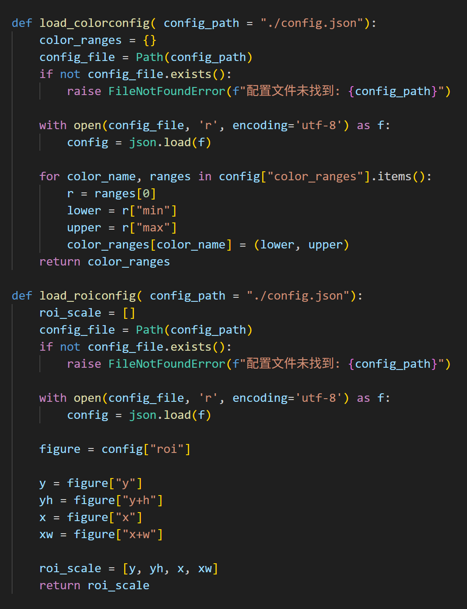
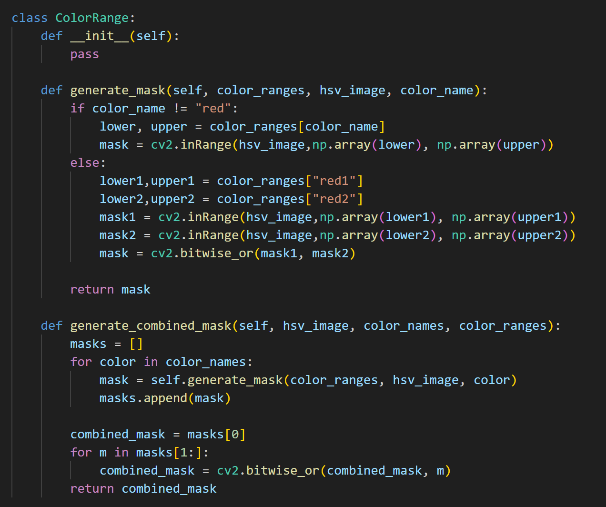
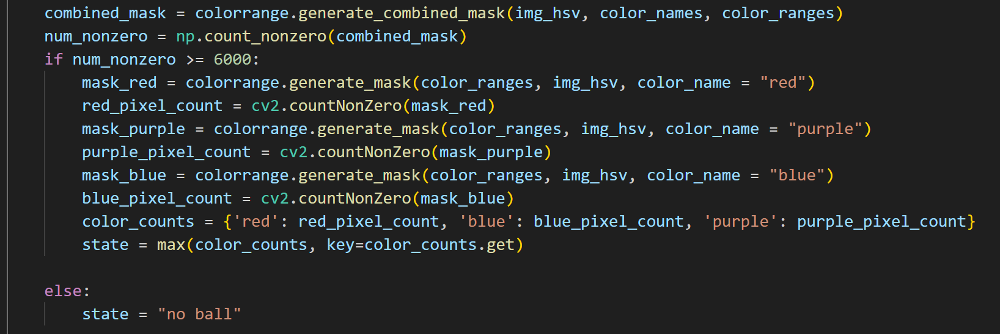

代码思路：
严格按照作业要求来，先cv2的读取视频，提取单帧画面（ai还帮我搞了一个返回帧数的功能，其实没啥用），同时读取config数据，然后是判定流程：roi+颜色掩膜+比较像素数（max的那个代码），其中判定无球依靠的是三色组合掩膜计算像素数，设定了一个阀值，大于即有球，接着进入具体的颜色判定。

config读取:

组合掩膜：

判定流程：

遇到的困惑：我对于面向对象编程的一些小点仍然有些难以理解，比如def main这个函数，再通过main（）来使用，这里是不是直接将main函数中的代码写在“if __name__ == "__main__":”下更方便些。

培训改进建议：上课时因为没有话筒，主讲人声音实在太轻了，经常性地跟不上。同时我认为自主写代码练习的时间应该给更多一些，培训感觉最大的价值在于附近有很多学长可以直接提问，主讲人把内容讲个大概，教案中再多放一些小的exercise，后续靠同学自行用ai等方式学习细节完成项目，遇到不懂的再提问，这样的教学方式我个人认为可能更适合算法这种以自学为主的东西。
